# 🏠 Adulting.exe

<p align="center">
  <strong>Because your house didn't come with a manual.</strong><br />
  An open-source, self-hosted home management dashboard that brings order to the chaos of household administration.
</p>

<p align="center">
  <a href="https://github.com/Thomas-Mildner/Adulting.Exe/releases"></a>
  <a href="LICENSE"></a>
  <a href="https://hub.docker.com/r/mildnerthomas/adulting-exe"></a>
  
  
</p>

<p align="center">
  <a href="https://thomas-mildner.github.io/Adulting.Exe/"><strong>🌐 Live Landing Page & Showcase</strong></a> •
  <a href="#-features"><strong>Features</strong></a> •
  <a href="#-quick-start-docker"><strong>Quick Start (Docker)</strong></a> •
  <a href="#-local-development"><strong>Local Development</strong></a> •
  <a href="#-screenshots"><strong>Screenshots</strong></a> •
  <a href="#-contributing"><strong>Contributing</strong></a>
</p>

---

## 📖 Overview

**Adulting.exe** centralizes everything about your home in one private, beautiful dashboard: warranties, appliances, contractor invoices, utility consumption, recurring maintenance tasks, waste collection schedules, lent tools, identity documents, vehicle logs, emergency contingency plans, and more.

Built for people who want to know exactly where the blender's original packaging is stored *before* the motor starts smoking, and who never want to search through old shoe boxes for receipts when tax season arrives.

* **100% Self-Hosted & Private:** Your household data stays completely on your own machine or home server.
* **Bilingual Out of the Box:** Full German (`de`) and English (`en`) support with instant language switching.
* **Modern Tech Stack:** Next.js (App Router, Turbopack), React 19, TypeScript, Tailwind CSS, shadcn/ui, PostgreSQL, Prisma, Docker.

---

## ✨ Features

The platform is organized into 4 cohesive household pillars covering **14+ dedicated modules**:

### 📦 1. Home & Inventory
* **Vault (Warranty Tracker):** Catalog household appliances with purchase dates, prices, serial numbers, and warranty badges:
  - 🛡️ **Protected:** Under active warranty
  - 🔧 **Solo:** Warranty expired
  - 🧟 **Zombie Mode:** Living dangerously without coverage
  - 📦 **Box Locator:** Document exact box storage locations (*e.g., "Attic, Sector 7, behind Christmas lights"*).
* **Maintenance Management:** Recurring household tasks (filter changes, HVAC inspections, chimney sweeping) with priority levels, due dates, and completion histories.
* **Knowledge Base (Library):** Centralized archive for manuals, user guides, PDFs, and Markdown how-tos categorized by Heating, Plumbing, Smart Home, Structural, or General.
* **Wishlist & Projects:** Plan renovations with target budgets, urgency levels, and savings progress tracking.

### ⚡ 2. Operations & Household Services
* **Utility Tracker:** Log monthly meter readings for electricity, water, and heating (Gas, Oil, District Heating, Heat Pump, Pellets) with interactive trend charts and cost tracking.
* **Waste Calendar:** Color-coded collection schedules (Restmüll, Bio, Papier, Gelber Sack) with dashboard countdown widget for your next pickup.
* **Services & Invoicing:** Directory of contractors and craftsmen with contact details, ratings, service history, invoice attachments, and tax-deductible expense tracking (§ 35a EStG).
* **Lend-O-Meter:** Track tools and items lent to neighbors and friends, complete with expected return dates, borrower contact notes, and reliability ratings.

### 👨‍👩‍👧 3. Family, Health & Emergency
* **Identity Guard:** Monitor IDs, passports, and driver's licenses per family member with expiry countdowns, physical storage locations, emergency lost-card guides, and status badges (🟢 *Model Citizen*, 🟡 *Bureaucratic Anxiety*, 🔴 *International Fugitive*).
* **Illness Tracker:** Per-person illness logs with start/end dates, symptoms, and a GitHub-style yearly sick-day heatmap.
* **Emergency Hub (Digitaler Notfallordner):**
  - Official hotlines & emergency ICE contacts with 1-click dialing.
  - Advance directives (living wills, healthcare proxies, custody orders) with physical storage locations and registry numbers.
  - Medical dossier (blood types, allergies, routine medications, doctors).
  - Main shut-off locations (water main valve, electrical breaker box, gas meter) with operating notes.
  - One-click printable DIN A4 emergency sheet for the fridge or emergency responders.
* **Pet Management Hub:** Profiles for all household pets with microchip numbers, vaccination deadlines, vet treatment history, and pet-sitter care instructions.

### 🚗 4. Mobility & Everyday Life
* **Garage (Car Pit):** Complete vehicle management: TÜV inspection reminders, seasonal tire swap tracking, maintenance logs, fuel/toll expenses, and digital document storage.
* **Contracts & Subscriptions:** Track running subscriptions and contracts with billing cycles (monthly/yearly), renewal alerts, automated cancellation letters, and a "Regret Meter" for unused services.
* **Meal Planning & Recipes:** Weekly meal planner with recipe collection, ingredient lists, and integration options for kitchen management.
* **Settings & System:** Person management, waste type configurations, module enable/disable switches, theme toggles (dark/light), and tax data export.

---

## 🚀 Quick Start (Docker)

The fastest way to run Adulting.exe is using **Docker Compose**.

### 1. Create `docker-compose.yml`

```yaml
version: "3.9"

services:
  postgres:
    image: postgres:16-alpine
    container_name: adulting-exe-db
    restart: unless-stopped
    environment:
      POSTGRES_USER: adulting
      POSTGRES_PASSWORD: <your-secure-password>
      POSTGRES_DB: adulting_exe
    ports:
      - "5432:5432"
    volumes:
      - pgdata:/var/lib/postgresql/data
    healthcheck:
      test: ["CMD-SHELL", "pg_isready -U adulting -d adulting_exe"]
      interval: 5s
      timeout: 5s
      retries: 10

  app:
    image: mildnerthomas/adulting-exe:latest
    container_name: adulting-exe-app
    restart: unless-stopped
    environment:
      DATABASE_URL: postgresql://adulting:<your-secure-password>@postgres:5432/adulting_exe
    ports:
      - "3000:3000"
    volumes:
      - uploads_data:/app/public/uploads
    depends_on:
      postgres:
        condition: service_healthy

volumes:
  pgdata:
  uploads_data:
```

> [!IMPORTANT]
> * Replace `<your-secure-password>` with a strong password (make sure it matches in both `POSTGRES_PASSWORD` and `DATABASE_URL`).
> * The `uploads_data` volume is essential to persist your uploaded receipts, manuals, and documents across container updates.

### 2. Start the Stack

```bash
docker compose up -d
```

Open [http://localhost:3000](http://localhost:3000) in your browser. Database migrations are applied automatically on startup.

### 3. Updating

```bash
docker compose pull app
docker compose up -d
```

#### Available Image Tags

| Tag | Description |
| :--- | :--- |
| `latest` | Latest stable production release |
| `main-latest` | Latest automated build from the main branch |
| `1.x.x` | Specific semantic version |
| `beta-latest` | Latest staging / pre-release build |

---

## 💻 Local Development

If you want to contribute or run the project directly from source:

### Prerequisites
* [Node.js](https://nodejs.org/) >= 18
* [pnpm](https://pnpm.io/) (recommended)
* [Docker](https://www.docker.com/) (for the local PostgreSQL instance)

### Setup Steps

```bash
# 1. Clone the repository
git clone https://github.com/Thomas-Mildner/Adulting.Exe.git
cd Adulting.Exe

# 2. Install dependencies
pnpm install

# 3. Start local PostgreSQL database container
docker compose up -d postgres

# 4. Configure environment
cp .env.example .env

# 5. Apply schema and seed demo data
pnpm db:push
pnpm db:seed

# 6. Start Turbopack development server
pnpm dev
```

Visit [http://localhost:3000](http://localhost:3000) to view the development server.

### Useful CLI Commands

| Command | Purpose |
| :--- | :--- |
| `pnpm dev` | Start development server with Turbopack |
| `pnpm build` | Run production build & TypeScript type checks |
| `pnpm start` | Start production server |
| `pnpm db:seed` | Seed database with sample household data |
| `pnpm db:studio` | Open Prisma Studio UI to inspect and edit database records |
| `pnpm db:generate` | Regenerate `@prisma/client` types after schema edits |
| `pnpm db:reset` | Reset local database and re-seed |

---

## 📸 Screenshots

All screenshots reflect the included sample seed data.

### 🏡 Main Dashboard
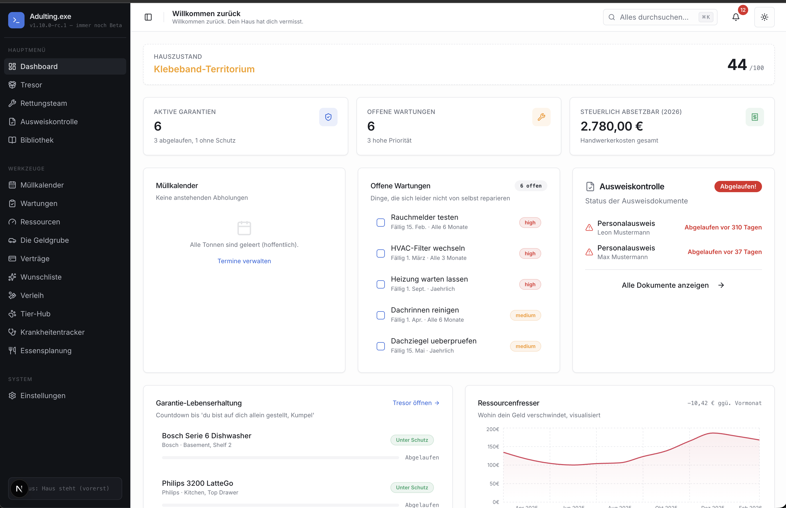

<details>
<summary><strong>🔍 Click to expand all module screenshots (10 images)</strong></summary>
<br />

| 📦 Vault (Appliance & Warranty Tracker) | 🛠️ Services & Invoices |
| :---: | :---: |
| 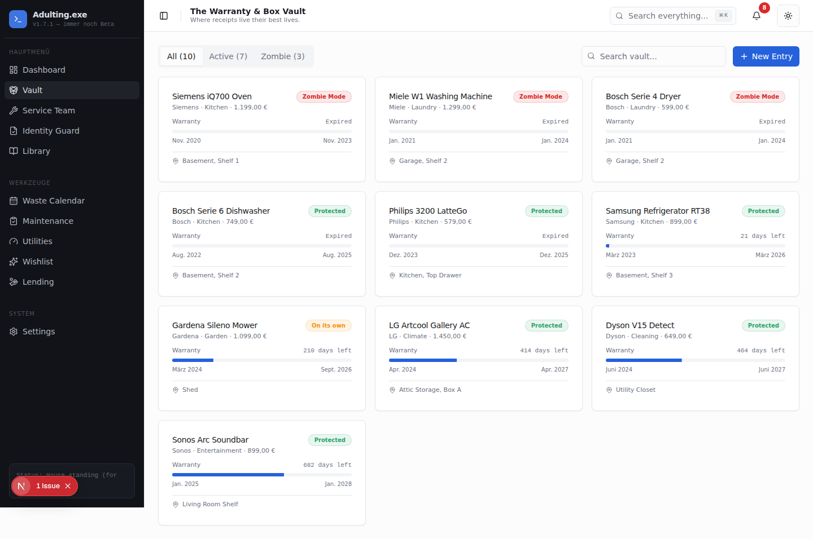 | 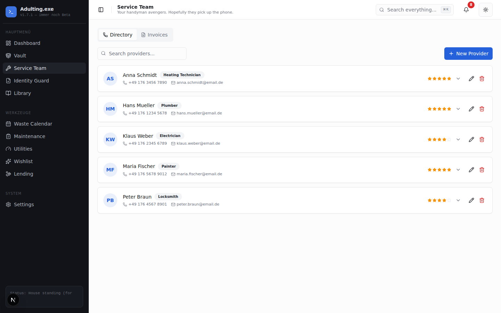 |

| 🪪 Identity Guard (Documents) | 🤒 Illness Tracker & Heatmap |
| :---: | :---: |
| 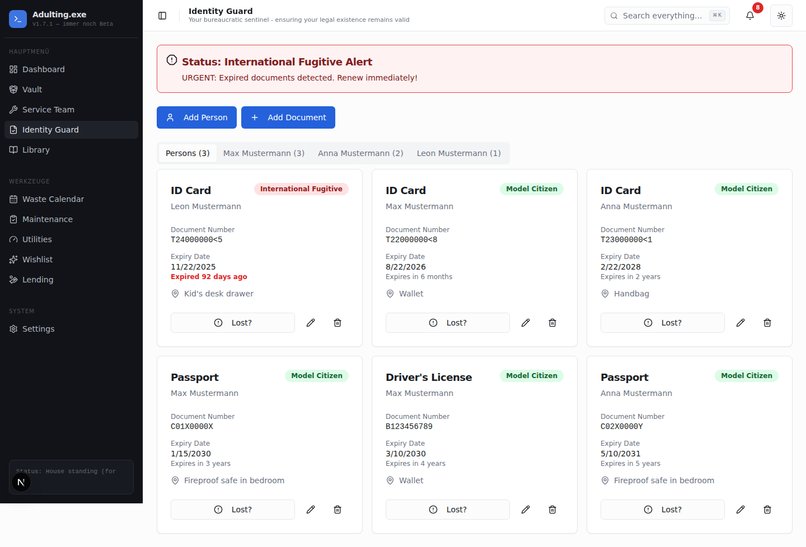 | 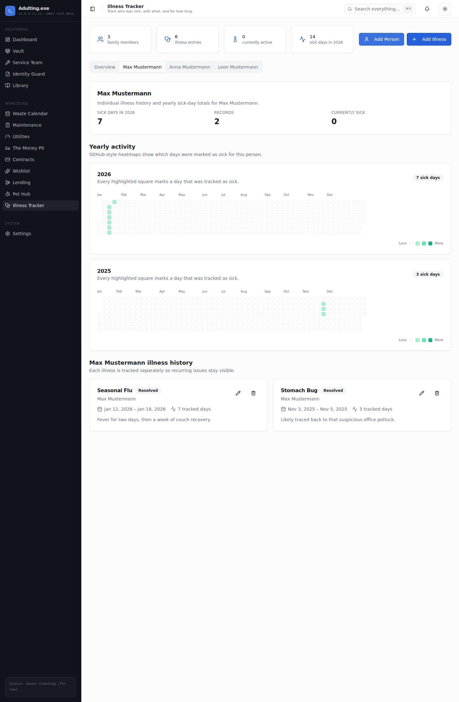 |

| 🔧 Maintenance Tasks | 📉 Utility Consumption |
| :---: | :---: |
| 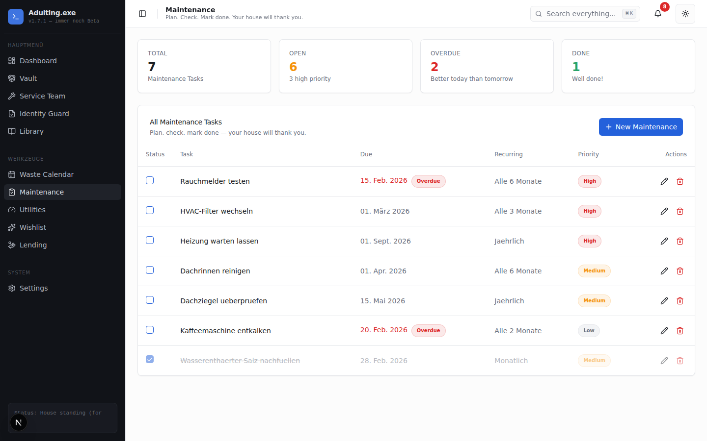 | 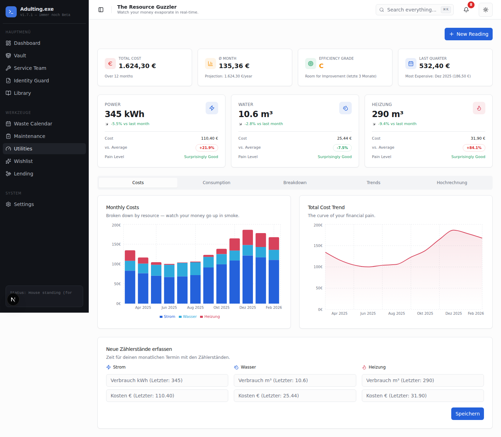 |

| 🎯 Projects & Wishlist | 🤝 Lend-O-Meter |
| :---: | :---: |
| 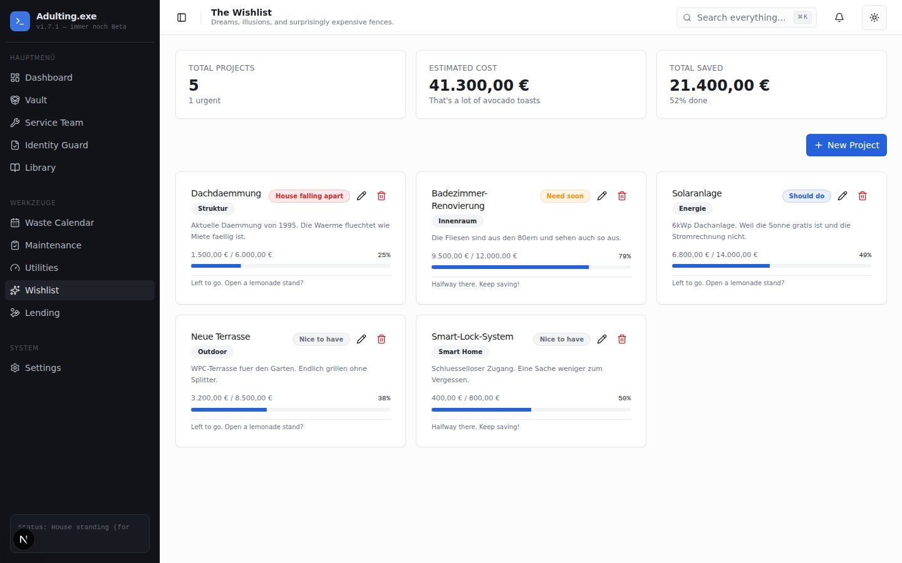 | 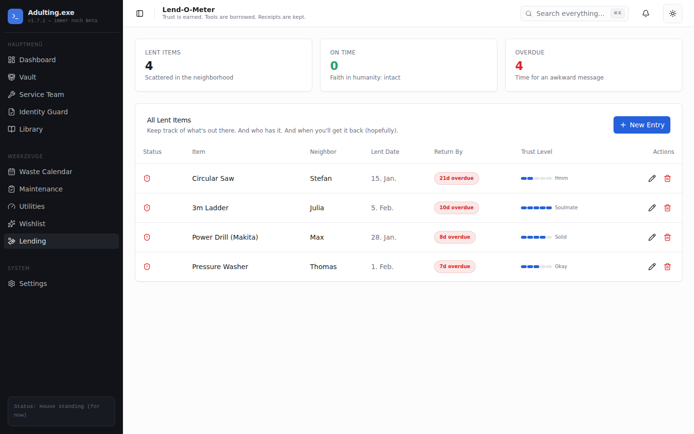 |

| 📚 Knowledge Base & Manuals | ⚙️ Settings & System |
| :---: | :---: |
| 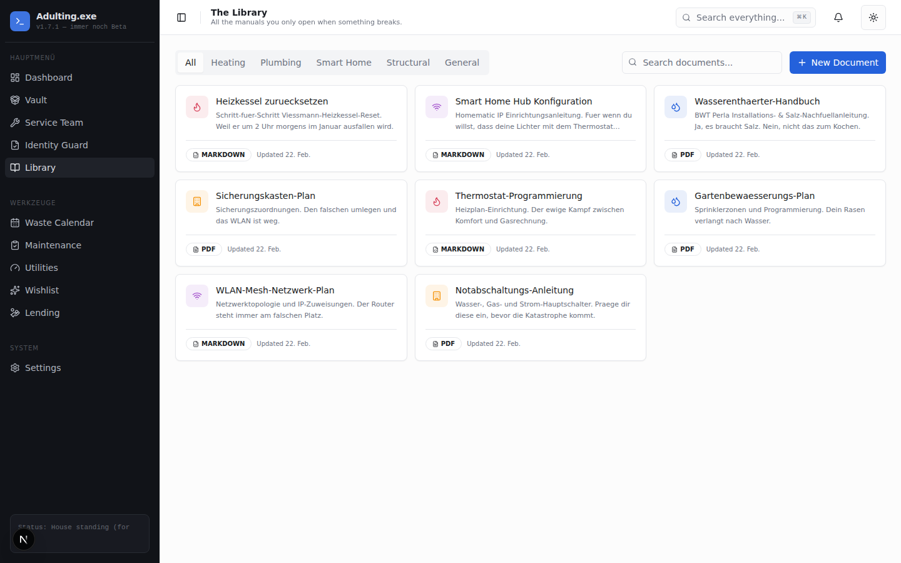 | 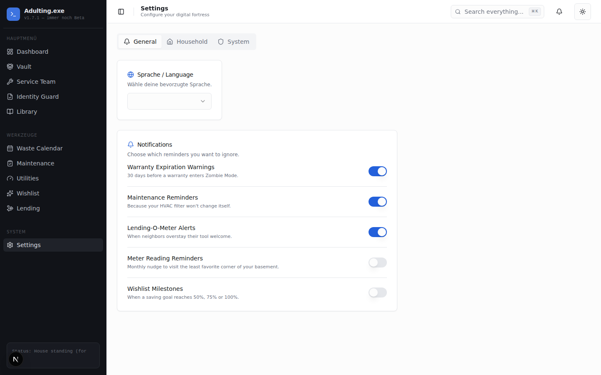 |

</details>

---

## 🗺️ Roadmap

### 🚀 Upcoming Modules

* **💊 Smart Medicine Cabinet (Smarte Hausapotheke):** Expiration date tracking for household medications, symptom/indication lookup, dosage leaflets, and DIN 13164 car first-aid kit inspector.
* **🛋️ Home Inventory & Value (§ Versicherungswert):** Room-by-room inventory of high-value items, automatic replacement value aggregation to prevent dangerous underinsurance, and 1-click insurance claim export with photos and receipts.
* **🧾 Tax Helper (§ 35a EStG Handwerkerbonus):** Automated extraction and aggregation of labor/travel costs from contractor invoices for German income tax deductions, utility bill splitting (*Nebenkostenabrechnung*), and 1-click export for tax software (Taxfix, WISO, Elster).
* **🔄 Subscription Radar & Notice Watchdog:** Micro-subscription audit, burn-rate insights, contract renewal countdowns, and automated cancellation letter generation.

### 🛠️ Platform Enhancements
- [ ] Smart Meter API integrations (automated electricity/water data ingestion)
- [ ] Push / Email notifications for maintenance tasks and expiring documents


---

## 🤝 Contributing

Contributions are warmly welcomed!

1. **Fork** the repository and create your feature branch:
   ```bash
   git checkout -b feat/your-feature-name
   ```
2. **Make your changes**, ensuring clean TypeScript code and adherence to existing conventions.
3. **Verify** your build passes:
   ```bash
   pnpm build
   ```
4. **Commit** using [Conventional Commits](https://www.conventionalcommits.org/):
   - `feat:` A new feature *(triggers MINOR release)*
   - `fix:` A bug fix *(triggers PATCH release)*
   - `docs:` Documentation changes only
   - `refactor:` Code refactoring
   - `chore:` Maintenance or dependency updates
5. **Open a Pull Request** with a concise description of your changes.

---

<p align="center">
  <sub>🏠 Adulting.exe — The house is still standing.</sub>
</p>
